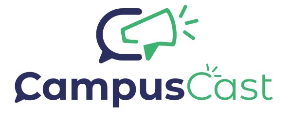

  

CampusCast is an IoT-based announcement system designed to improve communication within academic institutions. The system consists of hardware and software components, including a microcontroller, digital-to-analogue converter, power amplifier, acknowledgement button, backend IoT server, WebSocket technology, and mobile app. With CampusCast, teachers and authorities can send voice announcements with customizable routes to specific classrooms, branches, years, or classes, ensuring every message is received and acknowledged. The system also includes features such as Smart Notifications and Exam Time Alerts to provide targeted and timely communication without disrupting class activities. CampusCast aims to modernize the communication system in colleges and universities, enhance the campus experience for everyone involved, and improve student engagement and academic success.

- [CampusCast Mobile APP](https://github.com/e-labInnovations/CampusCast-app)
- [CampusCast Server](https://github.com/e-labInnovations/CampusCast-server)
